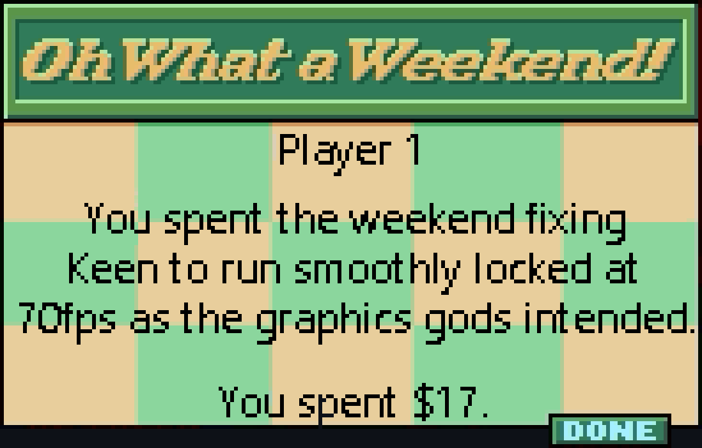
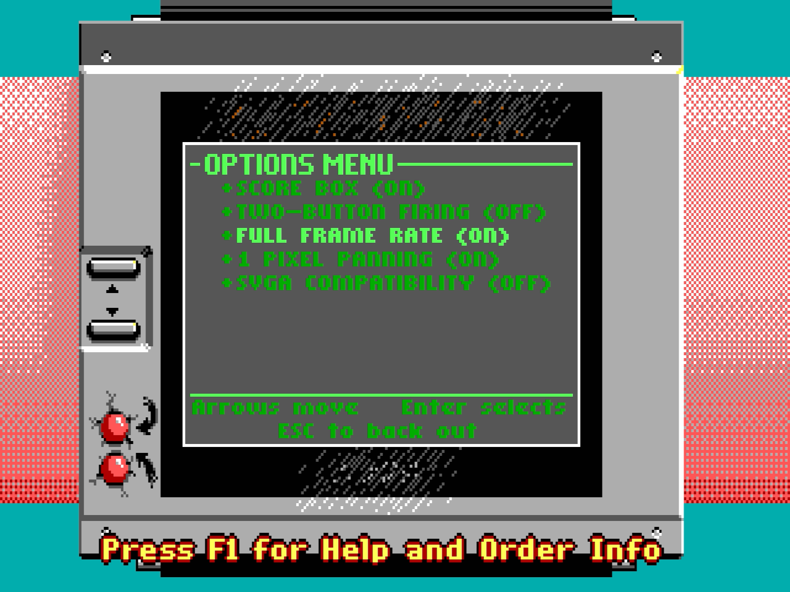

# Introduction

If you stumbled on to this repository, you are probably a PC vintage gaming nostalgist like me.

If so, here is a PC gaming history quiz question:

*What was the first ever DOS game, that*
```
a) ran at a VGA 320x200 resolution, so 70 Hz. (i.e. not Mode-X which was "only" 60hz), and
b) implemented hardware-based EGA/VGA scrolling (i.e. relied on the IBM graphics adapter's
   hardware feature instead of doing full screen repaints)
c) was programmed with the skill and sophistication needed that the game actually reached 70 fps
   on hardware of the era, without decimating or skipping frames or missing vsyncs?
```

Before I ventured on to this retro programming journey, my memory would have rather quickly answered: "Commander Keen 4, in 1991". But turns out that is not the case.

The original Keen 4-6 trilogy did pass on counts a)-b), but it was actually limited to run only at half speed, 35 fps (yeah, that "cinematic 30fps" approach has long roots), and additionally, id Software did not manage to program the game logic to be locked to vsync. To top it all off, their implementation of hardware scrolling synchronization was a bit hacky, first suffering from performance problems, and then later caused hardware incompatibilities on newer PCs with faster ISA buses and PCI graphics cards released the next year in 1992. The synchronization code was attempted to be fixed more than once by layering more hacks on top. Classic game developers, right? ;)

Was the first smooth 70 Hz scrolling game then maybe Jazz Jackrabbit in 1994? Well, it passes b) and c), but it ran at 60 Hz and not at 70 Hz, i.e. -14.3% fewer fps!

Maybe it was One Must Fall 2097? It was also 1994, and was butter smooth at 70 Hz, so a check on a) and c). But OMF was no platformer, hence did not need to scroll.

Shockingly, I realize I have no clue who would have been the first, so I posed the question on Vogons forums. Visit [Vogons: What was the first ever smooth 70 Hz hardware scrolling DOS game?](https://www.vogons.org/viewtopic.php?f=61&t=96174) to share your answer if you know.

But, in either case, now you finally *can* play Keen 4-6 smoothly at 70 Hz! Even on your old PC from the era.

# Commander Keen 4 70 fps

This mod is a technology demo to showcase that with some careful fixes/refactoring to their synchronization code, it would have been possible for Carmack and Romero to ship Keen running at 70 fps already in 1991, without microstuttering or missed frames, while retaining the performance compatibility for slow 286 PCs.



This repository changes:
- Fixes id Software's original code that failed to robustly synchronize to the VGA adapter's vblank.
- Removes the "Fix Jerky Motion" hack as redundant, since the code now properly calibrates itself to
  distinguish hblanks from vblanks.
- Refactors the game update logic to be locked tight to the 70 Hz update rate of the VGA adapter.
  This helps the game not miss vsyncs for much smoother gameplay at both 35 Hz or 70 Hz rates.
  On 60 Hz EGA adapters, the game will run decoupled as it used to.
- Adds a new Option menu setting, `"Full Frame Rate"` which, if enabled, updates the game to render
  at 70 Hz instead of the original frame-skipping 35 Hz. Note that when this option is enabled,
  some of the original game logic is impacted, as the game logic does not expect to run at 70 Hz.
  (Keen sometimes misses grabbing ledges, and can get stuck on bouncing red balls in the 1st level)
- Adds a new Option menu setting, `"1 Pixel Panning"` which, if enabled, updates the game hardware
  scrolling to occur at 1 pixel granularity, instead of the old 2 pixel granularity. This improves
  the smoothness of horizontal panning backgrounds.
  However, due to a limitation of EGA graphics modes, this will cause the Score board and Keen to
  stutter a bit.
- Adds support for CRT Terminator's combined vblank/frame counter registers to implement near
  seamless/watertight vsync locking that not need to disable interrupts, and is less disturbed by
  badly timed interrupts taking place. (optional, used only when available, helps slow PCs)

Tested to work smoothly on a 80 MHz 486 PC, that is slowed down to 25 MHz via the PC's Turbo button.

Had id Software pulled 70 Hz off in 1991, it would certainly have given the owners of fast 386/486 PCs also something **nonviolent** to proudly showcase!

## Running a precompiled version

Get the file [DIST/KEEN70HZ.ZIP](DIST/KEEN70HZ.ZIP), deploy it to DOSBox or your vintage PC, and run KEEN70HZ.EXE. The original Keen 4 v1.4 shareware version files are included, so you can also run KEEN4E.EXE to see how it was originally.

Note however that the CONFIG.CK4 files are not compatible, so you will need to reconfigure the settings when changing between executables.

## Source code

The source code in this repository is based on the awe inspiring work of user K1n9_Duk3 on PCKF forums, who recreated the Keen 4-6 source project by a combination of disassembly and pulling together known id Software source; the code was shared in this PCKF forum post: https://pckf.com/viewtopic.php?t=11505&sid=736f20ec1ee9afc7c479b67d6f1672db , obtained on 7th of September 2023.

See [readme.txt](readme.txt) for K1n9_Duk3's original readme in the zip file.

## Quick Setup for getting started compiling

1. Git clone this repository.
2. Either:
  a) Download and install DOSBox-X from https://dosbox-x.com/ . Mount the root of this repository as the root C:\ drive of DOSBox-X. This can be done easily by right-clicking in the cloned directory and choosing "Open with DOSBox-X." On Windows 11, you may need to choose the "More Options..." dropdown item first. An alternative way to open is to drag-and-drop the cloned repository folder onto the DOSBox-X executable icon.
  b) Alternatively deploy the files in this repository to your vintage MS-DOS 6.22 PC.
3. Run B4.BAT to open the Keen 4 EGA project.
4. Press F9 to compile the project.
5. Press Alt-X to quit back to DOS after compilation.
6. Run K4.BAT to launch the compiled Keen 4 executable.

When finished running the code, rerun B4.BAT to return back to the IDE.

## This repository uses...

- Like mentioned above, K1n9_Duk3's Keen 4-6 sources, modified. Licensed under GPL2.

- A deployment of CKPATCH v0.11.3 (unofficial), in directory [CKPATCH/](CKPATCH/), downloaded from http://ny.duke4.net/files.html , licensed under GPL2.

- A pre-deployment and extract of Commander Keen 4 EGA v1.4, in directory [K4E-14/](K4E-14/), downloaded from https://keenwiki.shikadi.net/wiki/Keen_4_Versions . Keen 4 is licensed Shareware from Apogee.

- Borland C++ 3.0, place it in directory BC30/. Copyright of Borland. Please acquire legal rights to Borland C++ 3.0 compiler, see [CONTACT.txt](BC30/ZIP/CONTACT.txt) for contacting Borland.

## I wish to compile other Keen versions than the prebundled Keen 4 EGA Shareware?

1. Purchase Commander Keen from [GOG.com: Commander Keen Complete Pack](https://www.gog.com/en/game/commander_keen_complete_pack) or from [Steam: Commander Keen](https://store.steampowered.com/app/9180/Commander_Keen/), or source it from your own purchased DOS copy.

2. Follow K1n9_Duk3's full instructions at [readme.txt](readme.txt) on how to unpack and extract the game data files.

3. Run one of the `RCK*.bat` files to open the relevant project files in the compiler IDE.
